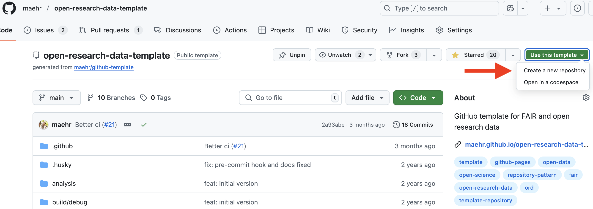
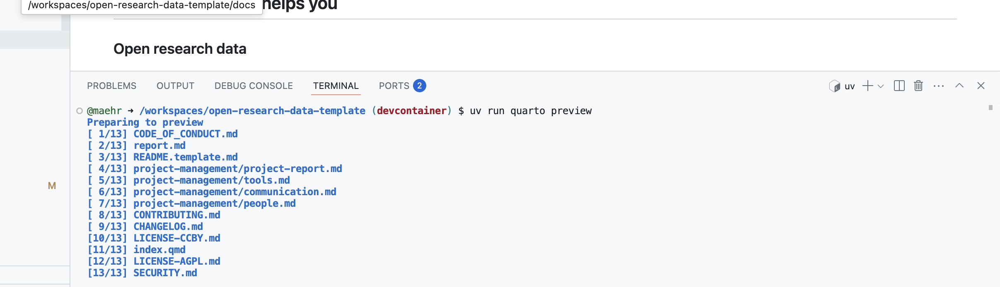

# Critical AI Literacy in Practice

This repository contains research materials and documentation for the project "Critical AI Literacy in Practice: Lessons from Current DH Projects". The research examines how digital humanities scholars can engage critically with AI tools while maintaining scholarly rigor and ethical standards.

[](https://github.com/maehr/critical-ai-literacy-in-practice/issues)
[](https://github.com/maehr/critical-ai-literacy-in-practice/network)
[](https://github.com/maehr/critical-ai-literacy-in-practice/stargazers)
[](https://github.com/maehr/critical-ai-literacy-in-practice/blob/main/LICENSE-AGPL.md)
[](https://github.com/maehr/critical-ai-literacy-in-practice/blob/main/LICENSE-CCBY.md)
[](https://doi.org/10.5281/zenodo.17086256)

## About the Project

This presentation explores critical AI literacy in digital humanities practice through case studies from Swiss institutions. We demonstrate how scholars can engage with AI tools responsibly while maintaining academic integrity and ethical standards.

### Key Questions

- How can digital humanities scholars develop critical AI literacy?
- What frameworks guide responsible AI implementation in research?
- How do current DH projects in Switzerland use AI tools ethically?
- What lessons can we learn from existing practices?

### Core Findings

- **AI is pervasive** in academic research and requires critical engagement
- **Historical understanding** of AI development provides essential context
- **Critical AI literacy frameworks** can guide responsible implementation
- **Swiss DH projects** demonstrate practical approaches to ethical AI use

## Critical AI Literacy Framework

Our research identifies six key components of critical AI literacy for digital humanities scholars:

### 1. Technical Literacy

Understanding how AI systems work, their capabilities and limitations, particularly large language models and their training processes.

### 2. Epistemological Awareness

Questioning what counts as knowledge and how AI shapes knowledge production in scholarly research.

### 3. Ethical Evaluation

Considering consent, privacy, transparency, and accountability in AI-assisted research workflows.

### 4. Social Impact Assessment

Examining power structures, equity issues, and broader implications of AI adoption in academia.

### 5. Practical Application

Developing workflows that maintain scholarly rigor while leveraging AI capabilities effectively.

### 6. Continuous Learning

Staying informed as AI technology evolves rapidly and adapting practices accordingly.

## Swiss Digital Humanities Projects Using AI

This research documents several innovative approaches to AI integration in Swiss DH projects:

### Re-Experiencing History with AI (University of Zurich)

The AIncient Studies Lab has developed an interactive platform for generating historically grounded visualizations of Classical antiquity using fine-tuned image and video generation models.

### Mini-Muse: Cultural Archive Access (SUPSI & ETH Library)

A pilot project exploring NLP and data visualization for exploratory access to digitized historical publications in the E-Periodica archive.

### Alt Text Generation (Stadt.Geschichte.Basel, University of Basel)

An open-source pipeline that enhances Dublin Core metadata by generating WCAG-compliant alt texts for historical sources and objects.

### Humanities Data Benchmark (RISE, University of Basel)

An open benchmark suite testing large language and multimodal models on humanities-relevant visual tasks, providing public leaderboards for model performance.

## Educational Initiatives

### University of Bern: Decoding Inequality

A critical examination of AI systems with focus on inequality and bias issues.

### University of Zurich: ChatGPT and Beyond

Interdisciplinary approaches to AI literacy combining practical skills with critical analysis.

## Repository Structure

The structure of this repository follows best practices for open research:

- `presentation/`: RevealJS presentation materials and slides
- `documentation/`: Additional research documentation
- `analysis/`: Research analysis scripts and notebooks
- `data/`: Research data and findings
- `src/`: Source code for tools and utilities

## Presentation

This repository includes a comprehensive presentation on Critical AI Literacy in Practice. The presentation covers:

- Historical context of AI development from Turing to modern LLMs
- Critical AI literacy frameworks for digital humanities
- Case studies from Swiss institutions
- Practical approaches to responsible AI implementation

To view the presentation locally:

```bash
quarto render
quarto preview
```

## Getting Started

### For Most Users: Reproducible Setup with GitHub Codespaces

1. **[Use this template](https://github.com/new?template_name=open-research-data-template&template_owner=maehr)** for your project in a new repository on your GitHub account.

   <div align="center">
     
   </div>

2. Click the green **`<> Code`** button at the top right of this repository.

3. Select the **“Codespaces”** tab and click **“Create codespace on `main`”**.
   GitHub will now build a container that includes:
   - ✅ Node.js (via `npm`)
   - ✅ Python with `uv`
   - ✅ R with `renv`
   - ✅ Quarto

   <div align="center">
     
   </div>

4. Once the Codespace is ready, open a terminal and preview the documentation:

   ```bash
   uv run quarto preview
   ```

   <div align="center">
     
   </div>

> **Note:** All dependencies (Node.js, Python, R, Quarto) are pre-installed in the Codespace.

<details>
<summary>👩‍💻 <strong>Advanced</strong> Local Installation</summary>

#### Prerequisites

- [Node.js](https://nodejs.org/en/download/)
- [Quarto](https://quarto.org/docs/get-started/)

> _Note: `uv` installs and manages the correct Python version automatically._

#### Local Setup Steps

```bash
# 1. Install Node.js dependencies
npm install
npm run prepare

# 2. Preview documentation
quarto preview
```

</details>

## Use

These research materials are openly available under open licenses and can be used for educational and research purposes. If you use this research in your work, please cite as specified in `CITATION.cff`.

The following citation formats are also available through _Zenodo_:

- [BibTeX](https://zenodo.org/record/17086257/export/hx)
- [CSL](https://zenodo.org/record/17086257/export/csl)
- [DataCite](https://zenodo.org/record/17086257/export/dcite4)
- [Dublin Core](https://zenodo.org/record/17086257/export/xd)
- [DCAT](https://zenodo.org/record/17086257/export/dcat)
- [JSON](https://zenodo.org/record/17086257/export/json)
- [JSON-LD](https://zenodo.org/record/17086257/export/schemaorg_jsonld)
- [GeoJSON](https://zenodo.org/record/17086257/export/geojson)
- [MARCXML](https://zenodo.org/record/17086257/export/xm)

_Zenodo_ provides an [API (REST & OAI-PMH)](https://developers.zenodo.org/) to access the data. For example, the following command will return the metadata for the most recent version:

```bash
curl -i https://zenodo.org/api/records/17086257
```

## Support

This project is maintained by [@maehr](https://github.com/maehr). Please understand that we can't provide individual support via email. We also believe that help is much more valuable when it's shared publicly, so more people can benefit from it.

| Type                                   | Platforms                                                                                   |
| -------------------------------------- | ------------------------------------------------------------------------------------------- |
| 🚨 **Bug Reports**                     | [GitHub Issue Tracker](https://github.com/maehr/critical-ai-literacy-in-practice/issues)    |
| 📊 **Report bad data**                 | [GitHub Issue Tracker](https://github.com/maehr/critical-ai-literacy-in-practice/issues)    |
| 📚 **Docs Issue**                      | [GitHub Issue Tracker](https://github.com/maehr/critical-ai-literacy-in-practice/issues)    |
| 🎁 **Feature Requests**                | [GitHub Issue Tracker](https://github.com/maehr/critical-ai-literacy-in-practice/issues)    |
| 🛡 **Report a security vulnerability** | See [SECURITY.md](SECURITY.md)                                                              |
| 💬 **General Questions**               | [GitHub Discussions](https://github.com/maehr/critical-ai-literacy-in-practice/discussions) |

## Roadmap

No changes are currently planned.

## Contributing

All contributions to this repository are welcome! If you find errors or problems with the data, or if you want to add new data or features, please open an issue or pull request. Please read [CONTRIBUTING.md](CONTRIBUTING.md) for details on our code of conduct and the process for submitting pull requests.

## Versioning

We use [SemVer](http://semver.org/) for versioning. The available versions are listed in the [tags on this repository](https://github.com/maehr/critical-ai-literacy-in-practice/tags).

## Authors and acknowledgment

- **Moritz Mähr** - _Initial work_ - [maehr](https://github.com/maehr)

See also the list of [contributors](https://github.com/maehr/critical-ai-literacy-in-practice/graphs/contributors) who contributed to this project.

## License

The data in this repository is released under the Creative Commons Attribution 4.0 International (CC BY 4.0) License - see the [LICENSE-CCBY](LICENSE-CCBY.md) file for details. By using this data, you agree to give appropriate credit to the original author(s) and to indicate if any modifications have been made.

The code in this repository is released under the GNU Affero General Public License v3.0 - see the [LICENSE-AGPL](LICENSE-AGPL.md) file for details. By using this code, you agree to make any modifications available under the same license.
